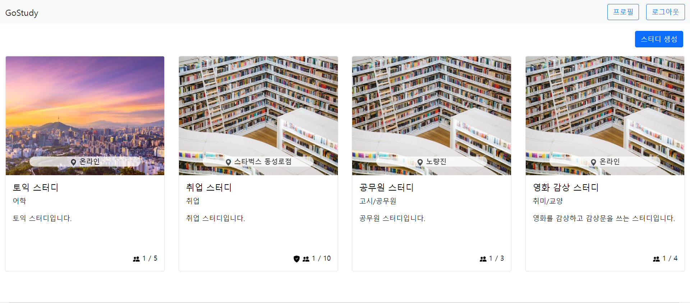
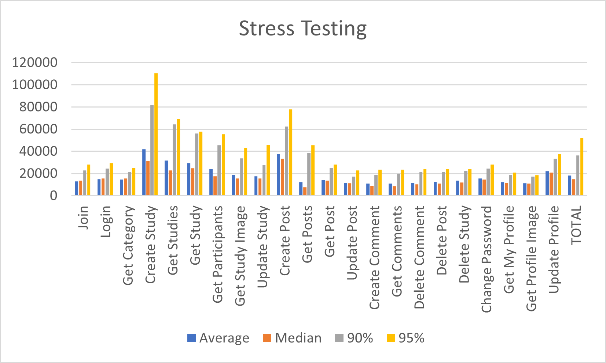

# GoStudy



Spring Boot로 구현한 스터디 플랫폼 웹 애플리케이션 입니다.

## Getting Started / 어떻게 시작하나요?

아래의 명령어로 서버를 직접 빌드해서 실행하거나 Docker Compose를 사용하여 바로 실행하시면 됩니다.
1. 직접 빌드하여 실행
```
git clone https://github.com/psh3253/GoStudy_BE.git
cd GoStudy_BE
./gradlew build
docker build -t gostudybe:lastest ./
docker run -it -d --name gostudybe gostudybe:lastest
```

2. Docker Compose를 사용하여 간편 실행
```
git clone https://github.com/psh3253/GoStudy_BE.git
cd GoStudy_BE
cd compose
docker compose up -d
```
+ [GoStudy's Frontend Server](https://github.com/psh3253/go_study_fe)
+ [GoStudy's Jenkins Server](http://be.goStudy.kr:8080)
+ [GoStudy's Web Site](http://gostudy.kro.kr:8080)

### Prerequisites / 선행 조건

아래 사항들이 설치 및 세팅이 되어있어야 하며 카카오 로그인을 사용하기 위해서 카카오 REST API 키를 발급하셔야 합니다.

```
MySQL Server 8.0 이상, Docker 20 이상
```

### 도커 설치
아래의 명령어로 필요한 모듈들을 설치합니다.

1. 저장소 설정
```
sudo apt-get update
sudo apt-get install \
    ca-certificates \
    curl \
    gnupg \
    lsb-release
sudo mkdir -p /etc/apt/keyrings
curl -fsSL https://download.docker.com/linux/ubuntu/gpg | sudo gpg --dearmor -o /etc/apt/keyrings/docker.gpg
echo \
  "deb [arch=$(dpkg --print-architecture) signed-by=/etc/apt/keyrings/docker.gpg] https://download.docker.com/linux/ubuntu \
  $(lsb_release -cs) stable" | sudo tee /etc/apt/sources.list.d/docker.list > /dev/null
```

2. 도커 엔진 설치
```
sudo apt-get update
sudo apt-get install docker-ce docker-ce-cli containerd.io docker-compose-plugin
```

### 카카오 REST API 키 발급 및 설정
1. [Kakao Developers](https://developers.kakao.com/) 사이트에 접속하여 로그인 후 내 애플리케이션 메뉴에 가서 애플리케이션 추가하기를 클릭

2. 앱 이름과 회사 이름을 아무거나 입력하고 저장하여 앱을 생성

3. REST API 키 복사

4. 제품 설정 > 카카오 로그인 > 보안 메뉴에서 Client Secret 발급 및 복사

5. 제품 설정 > 카카오 로그인 메뉴에서 활성화 설정 상태 스위치를 ON으로 설정한 후 Redirect URI를 "http://도메인/login/oauth2/code/kakao" 로 설정

6. 제품 설정 > 카카오 로그인 > 동의항목 메뉴에서 닉네임, 프로필 사진 필수 동의 및 카카오계정, 이메일 동의로 설정(※카카오 계정으로 정부 수집 후 제공 체크 필수)

### 사전 설정
1. /src/main/resources 디렉터리에 존재하는 application.properties 파일에 아래 내용 추가
```
spring.datasource.password=MySQL 비밀번호
```

2. /src/main/resources 디렉터리에 존재하는 application-oauth.properties 파일에 아래 내용 추가
```
spring.security.oauth2.client.registration.kakao.client-id=카카오 REST API 키
spring.security.oauth2.client.registration.kakao.client-secret=카카오 CLIENT SECRET
```

3. MySQL 서버에 gostudy 데이터베이스 생성


## Built With / 누구랑 만들었나요?

* [박세훈](https://github.com/psh3253) - 프로젝트 전체 설계 및 제작

## Function / 기능
+ 로그인 및 회원가입
+ 카카오 간편 로그인
+ 스터디 생성, 수정, 삭제
+ 이미지가 첨부가능한 스터디 게시판
+ 랜덤 URL을 통한 비공개 스터디 접근
+ 스터디 가입, 신청, 수락, 퇴장
+ 자신의 프로필 및 스터디 모아보기

## Technology / 기술

+ Spring Security를 사용하여 JWT 로그인 구현
+ Spring Data JPA를 사용하여 데이터 접근 계층 구현
+ OAuth2와 Kakao Rest API를 사용하여 카카오 간편 로그인 구현
+ Junit과 Mockito를 사용하여 단위 테스트 코드 구현
+ Docker Container를 사용하여 프로젝트 배포
+ Jenkins와 Github를 사용하여 CI/CD 환경 구축
+ Vue.js를 사용하여 프로트엔드 서버 구축
+ Jmeter를 통한 부하테스트

## Todo
+ 스터디 구성인원 상호평가 기능 추가
+ 캐시서버 구축

## Stress Test Result / 부하 테스트 결과

### 캐시서버 구축 전


### 캐시서버 구축 후
업로드 예정

## License / 라이센스

이 프로젝트는 GPL-3.0 라이센스로 라이센스가 부여되어 있습니다. 자세한 내용은 LICENSE 파일을 참고하세요.
